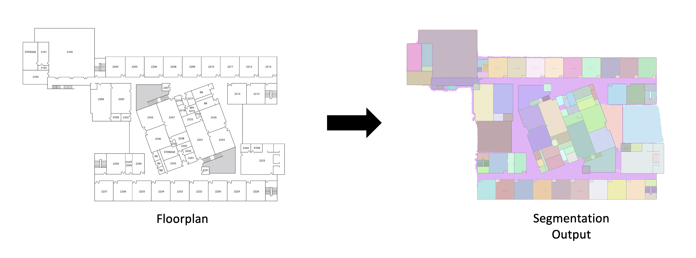

# Room Segmentation using Segment-Anything Model (SAM)

This repository contains code and instructions for performing room segmentation on floorplan images using the Segment-Anything Model (SAM).

## Getting Started

Follow the steps below to run the code and perform SAM inference for room segmentation:

### Prerequisites

Before running the code, ensure you have the prerequisites installed from the requirements.txt file:

- pip install -r requirements.txt

## Usage

### Run the Inference Notebook
Open and run the room-segmentation-using-sam.ipynb Jupyter Notebook. This notebook provides step-by-step instructions and code for performing SAM inference on your floorplan images.

### Customize Parameters
Inside the notebook, you have the option to customize various parameters for SAM, including points_per_side, pred_iou_thresh, stability_score_thresh, and more. Experiment with these settings to optimize room segmentation for your specific images.

### View Results
The notebook will generate room segmentation masks and display the results. You can also save the segmented images for further analysis.

